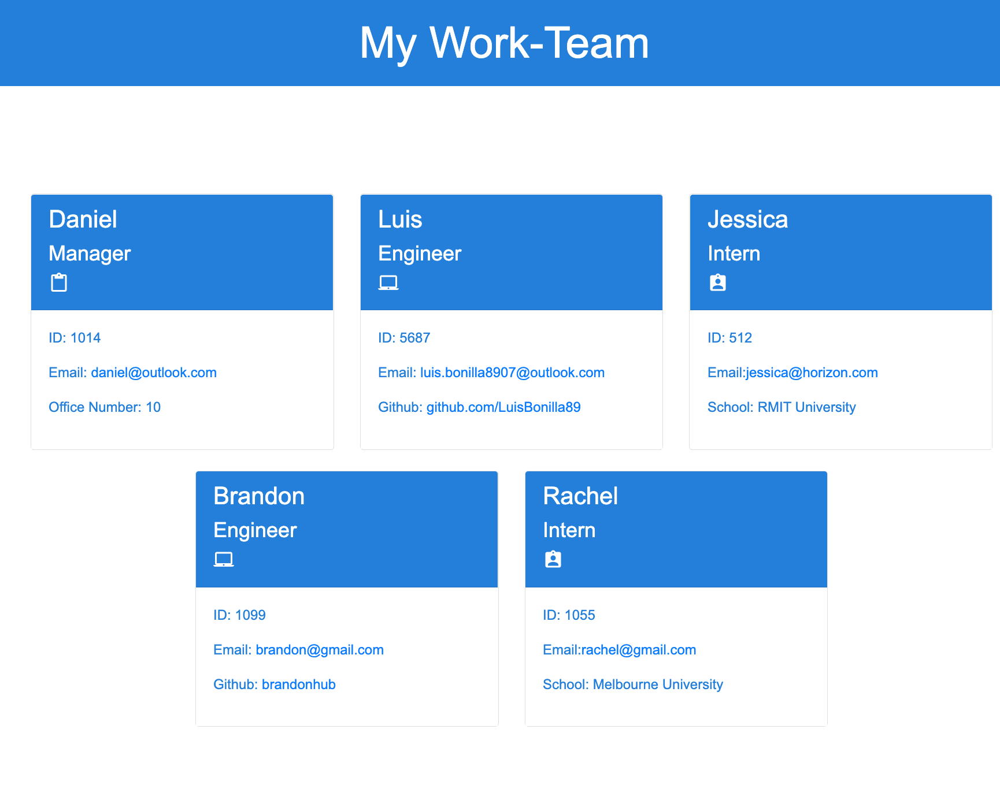

# 10 Object-Oriented Programming: Team Profile Generator

The purpose of this assignment was to create a Team Profile Generator.

This application uses [Jest](https://www.npmjs.com/package/jest) for running the unit tests and [Inquirer](https://www.npmjs.com/package/inquirer) for collecting input from the user. The application can also be invoked by using the following command:

node index.js

## Implementation Details

1. This aplication incorporates the use of class constructors for the team members (Manager, Engineer and Intern under the Employee class)

2. Consolidated redundancy in CSS file of some of the styling properties by grouping selector types under the same conditions.

3. This application utilises JQuery and Bootstrap frameworks.

4. 4 different test have been created to validate the library (Intern.js, Manager.js, Enployee.js and Engineer.js)

## Screenshot

## Deployed Application

Please click the following link:

https://luisbonilla89.github.io/Homework-10-Team-Profile/
